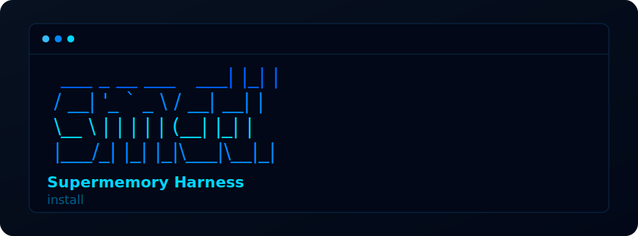

# Supermemory Harness

Supermemory Harness (`smctl`) is a local command center for Supermemory Local. It keeps the privacy and local-first shape of Supermemory, then adds the operational layer users and AI agents need: onboarding, health, project scope, risky-write review, recall proof, repair guidance, personalization, and reviewed Local-to-Cloud migration.

It does not replace Supermemory Local. It wraps the local server so users, Codex/Claude-style agents, and Supermemory developers can answer one question quickly: **is this memory safe and useful to rely on right now?**

## What Changes After Install

- The normal Supermemory dashboard can run through a local Harness command center at `http://localhost:6778`.
- `smctl supermemory start` shows Harness trust events beside the normal Supermemory server logs.
- Codex and Claude-style agents get bridge instructions, pre-action gates, repair paths, and compaction handoff rules.
- Guard can review risky memory writes before they become durable Supermemory memories.
- Memory Genome shows what kinds of memories the user stores and can install a local policy for future writes.
- Users get exact next commands instead of guessing from logs, MCP config, failed writes, or stale recall.

## Quick Start

Install globally from GitHub:

```bash
npm install -g github:MONSTER13LIAR/Supermemory-Harness
smctl enhance
```

Requirements:

- Node.js 22+
- npm
- Supermemory Local, normally reachable at `http://localhost:6767`
- Optional: Ollama on `http://localhost:11434` for local plain-English explanations

`smctl enhance` is the normal entrypoint. It checks Supermemory Local, applies Harness-owned setup, installs memory behavior skills, connects coding-agent bridge files, initializes project memory scope when missing, starts the dashboard proxy when Local is reachable, and writes an activation receipt at `~/.config/smctl/activation.json`.

The install/enhance flow opens with the same blue terminal banner shown above, so the first run feels like a product rather than a raw diagnostics script.

For local development from this repo:

```bash
node ./bin/smctl.js install
npm test
```

## Screenshots

The final screenshot set lives in [docs/assets/screenshots](docs/assets/screenshots). Use the video as the main launch hook; these screenshots are the GitHub and social proof layer for install polish, live verification, repair, terminal flow, and the dashboard.

<table>
  <tr>
    <td>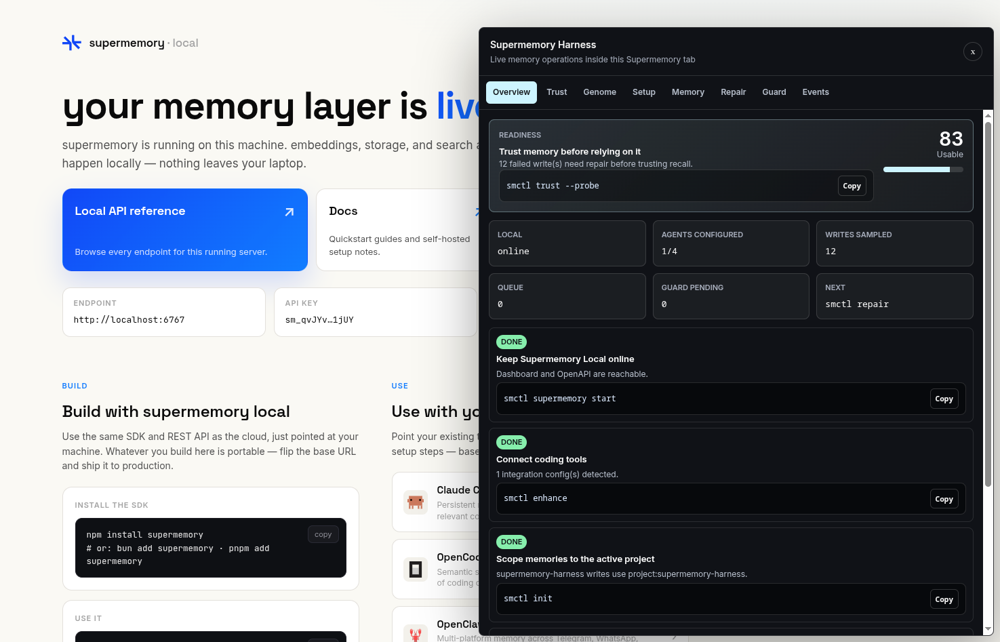<br><sub>Dashboard command center inside the Supermemory Local flow.</sub></td>
    <td>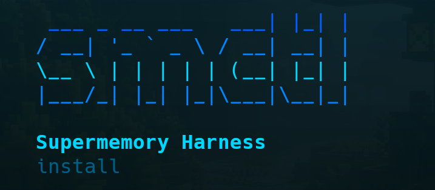<br><sub>Install opens with a product-grade terminal banner.</sub></td>
  </tr>
  <tr>
    <td>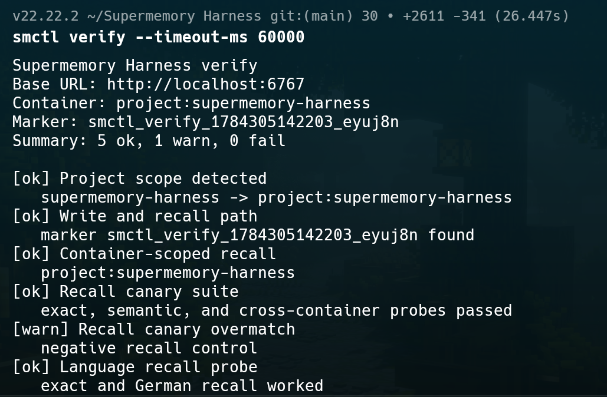<br><sub>Recall verification proves write, search, scope, and language recall.</sub></td>
    <td>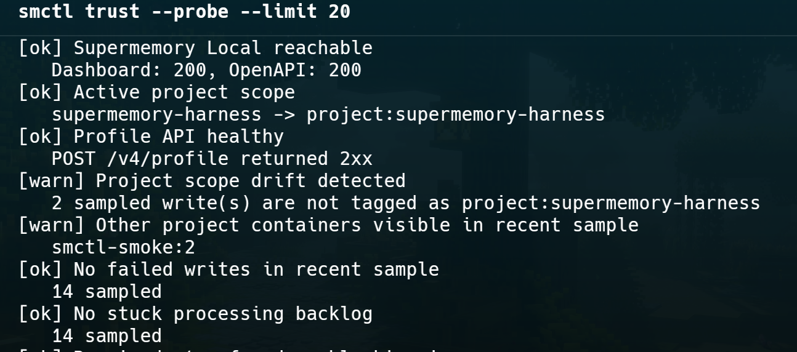<br><sub>Trust probe checks live Supermemory Local health and memory quality.</sub></td>
  </tr>
  <tr>
    <td>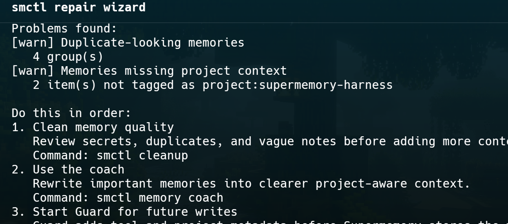<br><sub>Repair wizard turns broken memory state into ordered safe actions.</sub></td>
    <td>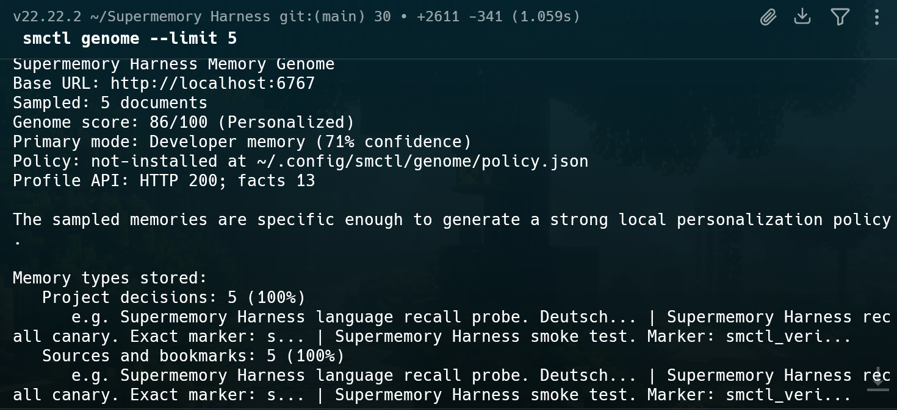<br><sub>Memory Genome classifies what the user stores and generates policy.</sub></td>
  </tr>
  <tr>
    <td>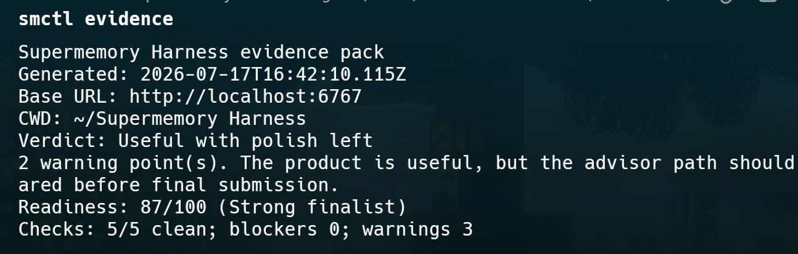<br><sub>Evidence pack gives judges and maintainers a redacted proof summary.</sub></td>
    <td>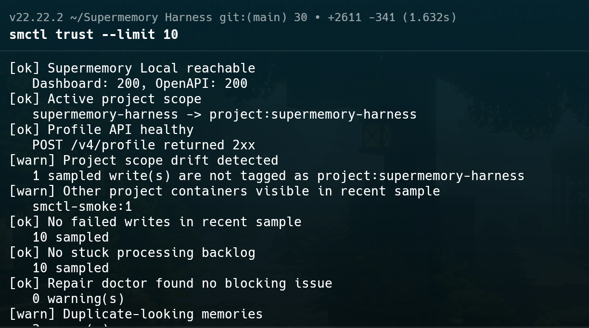<br><sub>Trust doctor exposes drift, scope, queue, processing, and duplicate signals.</sub></td>
  </tr>
  <tr>
    <td>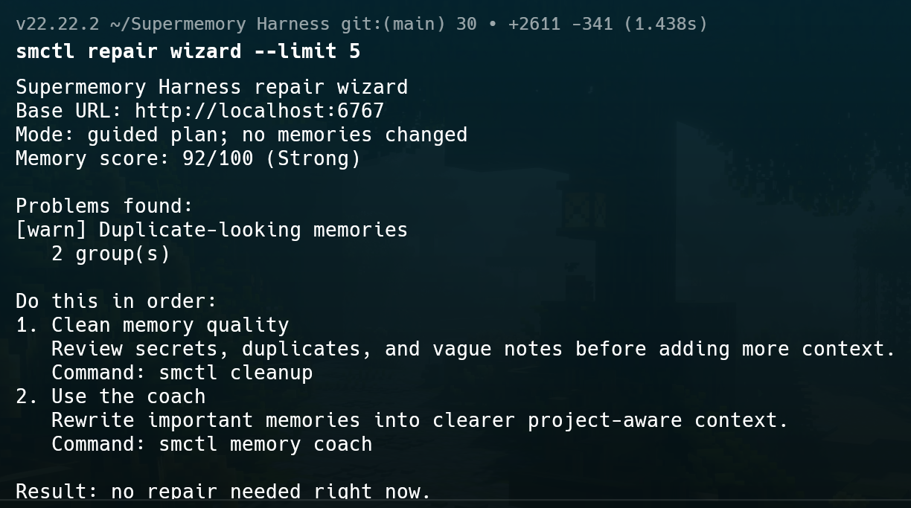<br><sub>Repair can also prove there is nothing unsafe to replay.</sub></td>
    <td>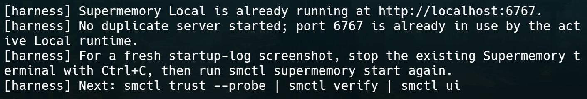<br><sub>Duplicate startup is handled cleanly when Local is already running.</sub></td>
  </tr>
</table>

## Final Demo Path

Use this sequence for a judge, maintainer, or serious first-time user:

```bash
smctl enhance
smctl evidence
smctl advisor
smctl recommend
smctl launch
smctl genome
smctl trust --probe
```

What each command proves:

- `smctl evidence` writes a redacted proof pack with verdict, architecture, blockers, demo commands, Memory Genome state, launch score, and exact next command.
- `smctl advisor` gives the operating plan for users, agents, Supermemory paths, local Llama usage, blockers, and next action.
- `smctl recommend` explains why a senior AI engineer or Supermemory developer would recommend Harness as the operational companion for Local.
- `smctl launch` shows the live launch board: recommendation, score, proof checklist, demo script, expert brief, and next command.
- `smctl genome` classifies the user's memory mix and generates a local personalization policy for Guard.
- `smctl trust --probe` performs the opt-in live proof: harmless write, processing, search, and scoped recall.

If Local is offline or broken, the demo still works: Harness reports the blocker plainly and points to the next command instead of pretending the system is ready.

The hackathon runbook is in [docs/hackathon-submission.md](docs/hackathon-submission.md).

## Product Argument

Many memory demos show one app that uses memory. Harness improves the Supermemory Local experience itself.

| Problem in local memory products | Harness answer |
| --- | --- |
| Users cannot tell whether Local, MCP, processing, and recall are healthy. | `watch`, `status`, `score`, `launch`, and the dashboard proxy make state visible. |
| AI agents can rely on stale, cross-project, vague, or failed memories. | `session`, `gate`, `trust`, and agent bridge instructions enforce memory checks before important work. |
| Risky or noisy captures can become permanent memory. | Guard reviews risky writes and applies project, skillset, and Genome metadata before forwarding. |
| Background processing feels opaque. | Dream Flight Recorder snapshots queued, completed, failed, disappeared, and changed documents. |
| Broken memory leaves users guessing. | `repair wizard` turns symptoms into an ordered safe plan. |
| Local memories can become a dead end. | `migrate` reviews what can safely move to Supermemory Cloud and stores receipts. |
| Personalization is invisible. | Memory Genome shows what the user stores and installs a local policy for future memory behavior. |

## Architecture

Harness stays local and wraps Supermemory instead of replacing it.

- Self-install path: `smctl enhance` configures Harness-owned files, skills, agent bridge instructions, project scope, and the dashboard proxy.
- Codex / Claude Code path: agents read bridge instructions and run `smctl advisor`, `smctl session pre-action`, `smctl trust`, `smctl genome`, and `smctl repair wizard` before relying on memory.
- Write path: apps and agents can write through Guard at `localhost:6777`; Guard reviews risk, applies metadata, then forwards approved writes to Supermemory Local at `localhost:6767`.
- Dashboard path: `smctl ui` serves a local proxy at `localhost:6778`, forwards the real Supermemory dashboard, and injects the Harness command center.
- Terminal path: `smctl supermemory start` starts `supermemory-server` from the home store and streams Harness trust snapshots beside normal server logs.
- Local Llama path: `--explain` and `smctl brain doctor` use Ollama only for short explanations. Deterministic Harness checks remain the source of truth.

Common hurdles are expected and handled by commands:

- Local offline or wrong launch folder: `smctl supermemory start`
- Port `6767` already in use: `smctl supermemory start` now detects an active Local server and exits cleanly; stop the old terminal first only when you want fresh startup logs.
- MCP missing or misconfigured: `smctl doctor`
- Agent bridge missing: `smctl agent connect all`
- Failed writes, schema issues, or runtime errors: `smctl repair wizard`
- Noisy or secret-like captures: `smctl guard inbox`
- Weak personalization: `smctl genome`
- Missing local Llama: `smctl brain doctor`

## Core Commands

Show every command:

```bash
smctl help
```

Recommended command map:

| Command | Purpose |
| --- | --- |
| `smctl enhance` | One-command activation for setup, skills, bridge files, project scope, and dashboard proxy. |
| `smctl evidence` | Redacted proof pack for judges, users, agents, and Supermemory maintainers. |
| `smctl advisor` | One-command operating plan across user flow, agents, Supermemory paths, Llama, blockers, and next action. |
| `smctl recommend` | Ten-feature product recommendation from senior AI and Supermemory developer perspectives. |
| `smctl launch` | Final readiness board with score, proof checklist, demo script, expert brief, and next command. |
| `smctl workflow` | Install-to-trust architecture, real pain points, and automation boundaries. |
| `smctl watch` | Compact activity bar for Local, agents, memory flow, queue, dreams, Guard, and next action. |
| `smctl trust` | Memory Trust Doctor for scope, health, recall, recovery, and safety. |
| `smctl trust --probe` | Opt-in live recall proof using a harmless marker. |
| `smctl genome` | Classify stored memory types and generate a local personalization policy. |
| `smctl genome apply` | Install the generated policy for Guard when memory quality allows it. |
| `smctl gate` | Pre-action memory governance gate for agents. |
| `smctl guard inbox` | Review pending risky writes before they are committed to Local. |
| `smctl repair wizard` | Ordered repair plan for failed writes, stale queues, retry loops, and recall mismatch. |
| `smctl migrate doctor --redact` | Reviewed Local-to-Cloud migration readiness without leaking secrets. |
| `smctl support` | Redacted support bundle for debugging Local, MCP, memory, dreams, migration, and Guard. |
| `smctl backup --dry-run` | Data-only backup preview that excludes API keys and auth/provider secrets. |
| `smctl brain doctor` | Check local Ollama/Llama readiness for no-cloud explanations. |

Full state sweep:

```bash
smctl enhance
smctl evidence
smctl advisor
smctl recommend
smctl executive
smctl workflow
smctl launch
smctl support
smctl backup --dry-run
smctl audit
smctl watch
smctl trust
smctl supermemory start
smctl session pre-action
smctl agent connect all
smctl ui
smctl status
smctl status --explain
smctl score
smctl gate --explain
smctl genome
smctl genome apply
smctl migrate doctor
smctl migrate plan
smctl migrate review
smctl migrate cloud --dry-run
smctl migrate cloud --apply
smctl migrate retry
smctl migrate verify
smctl migrate report
```

## Dashboard Command Center

Run:

```bash
smctl ui
```

Open `http://localhost:6778` to use the Supermemory dashboard with the Harness Bar at the top.

The embedded panel includes:

- Overview: local server, coding tools, and verified recall path.
- Trust: Memory Trust Doctor plus failed writes, missing project context, source anchors, secrets, vague notes, duplicates, empty recall containers, and store risk.
- Genome: memory-type classification, profile facts, personalization gaps, and local Guard policy install.
- Setup: safe local setup actions and manual coding-tool installer steps.
- Memory: queue, dreaming, failed writes, and verify probe.
- Repair: ordered repair plan.
- Guard: pending risky writes.
- Events: recent Supermemory write activity.

## Agent Workflow

`smctl enhance` connects supported coding agents automatically. You can refresh the bridge directly:

```bash
smctl agent connect codex
smctl agent connect claude
smctl agent status
```

The bridge tells agents to run:

- `smctl session pre-action --json` before risky edits, tests, migrations, or dependency changes.
- `smctl session pre-compact --json` before context compaction.
- `smctl session stop --json` before ending or handing off a session.
- `smctl advisor --json` when the user asks what to do next.
- `smctl evidence --json` when the user wants a shareable proof pack.
- `smctl trust --json`, `smctl genome --json`, and `smctl repair wizard --json` when memory state matters.

Agents should treat Harness pass/warn/fail checks as authoritative. Local Llama explanations are summaries, not health decisions.

## Memory Genome

Memory Genome classifies sampled Local memories into categories such as preferences, project decisions, bug fixes, loose ends, source material, coding conventions, repeated failures, hardware experience, and customer context.

```bash
smctl genome
smctl genome apply
npm run genome
```

The generated policy tells Guard what to remember, ignore, review before saving, and recall first. `genome apply` refuses to install when blocking memory quality issues make personalization unsafe.

## Local-To-Cloud Migration

Harness helps users move useful Local knowledge toward Supermemory Cloud without treating Local as a dead-end sandbox.

```bash
smctl migrate doctor
smctl migrate plan
smctl migrate review
smctl migrate cloud --dry-run
SUPERMEMORY_CLOUD_API_KEY=... smctl migrate cloud --apply
smctl migrate verify
smctl migrate report
```

Migration is safe by default:

- `doctor` gives a readiness score.
- `plan` and `cloud --dry-run` preserve useful title, content, project/container tags, source anchors, local IDs, timestamps, and content hashes.
- Failed, duplicate-looking, empty, or risky memories are held for review.
- `--redact` replaces detected secret material with `[REDACTED]`.
- `cloud --apply` stores an audit receipt under `~/.config/smctl/migrations/`.

Harness does not claim a byte-perfect clone of Supermemory internals. Original database IDs, embeddings, chunk IDs, auth/session state, and Local-only processing state remain Supermemory internals.

## Native Supermemory Enhancements

When a Supermemory source checkout is present, `smctl enhance` can also apply native source enhancements:

- Agent Memory readiness panel on the Supermemory Desktop home screen.
- Local-first coding-agent MCP setup at `http://localhost:6767/mcp`, with `SUPERMEMORY_MCP_URL` as an override.
- Project Scope Lock for MCP graph/data reads.
- Fail-open OpenAI middleware so temporary retrieval failure does not crash chat requests unless strict mode is enabled.

Point Harness at a checkout explicitly:

```bash
smctl enhance --supermemory-source /path/to/supermemory
```

## Safety And Privacy

- Core diagnostics are local and read-only unless a command explicitly says it writes.
- Risky writes, live proof writes, migration apply, and future destructive cleanup require explicit user intent.
- Output redacts obvious API keys, tokens, private keys, and home-directory paths in support/evidence flows.
- `backup` excludes `api-key`, `auth-secret`, and `env.enc`.
- Local Llama is optional and used only for plain-English summaries.
- Harness does not claim localhost checks validate API-key correctness, because Supermemory Local can auto-apply localhost auth.
- Harness does not silently run Claude Code, Codex, or OpenCode plugin installers; it writes bridge files and prints exact next commands.

## Hardware And Experience Capture

Harness can capture robotics/device logs as tagged Supermemory experience memories:

```bash
smctl hardware init --name "robot-arm-v1"
smctl hardware ingest --from ./run.log --session grasp-test
arduino-cli monitor -p /dev/ttyUSB0 | smctl hardware observe --stdin --device robot-arm-v1 --session live-test
smctl hardware coach
smctl hardware replay
```

The board or robot does not run Supermemory directly. Its software bridge emits logs/events, and Harness compresses them into tagged memories.

## Development

Run tests:

```bash
npm test
```

Useful local scripts:

```bash
npm run advisor
npm run evidence
npm run recommend
npm run launch
npm run genome
npm run doctor
```

JSON output is available for automation:

```bash
smctl evidence --json
smctl advisor --json
smctl trust --json
smctl repair wizard --json
```

The CLI banner uses Supermemory-style blue ANSI terminal colors when color output is available. GitHub cannot render live ANSI terminal color in Markdown, so the banner above is a terminal-faithful SVG render. The CLI respects `NO_COLOR=1` and can be forced with `FORCE_COLOR=1`.

## Current Scope

Harness currently ships:

- Onboarding: `enhance`, `install`, `setup`, `init`, `project`
- Readiness: `doctor`, `watch`, `status`, `score`, `audit`, `executive`, `workflow`, `launch`, `recommend`, `advisor`, `evidence`
- Trust and proof: `trust`, `trust --probe`, `verify`, `smoke`, `gate`, `session`
- Memory quality: `memory doctor`, `memory coach`, `memory replay`, `dreams`, `timeline`, `cleanup`
- Personalization: `genome`, `genome apply`, `skillset`, `skills`
- Recovery: `repair`, `repair wizard`, `support`, `backup`
- Migration: `migrate doctor`, `plan`, `review`, `cloud`, `retry`, `verify`, `receipt`, `report`
- Runtime surfaces: `supermemory start`, `ui`, `guard`
- Optional intelligence: `brain`, `smart`
- Experience capture: `hardware`

The project is intentionally conservative: it makes Local state observable, gives exact next commands, and keeps high-risk actions explicit.
